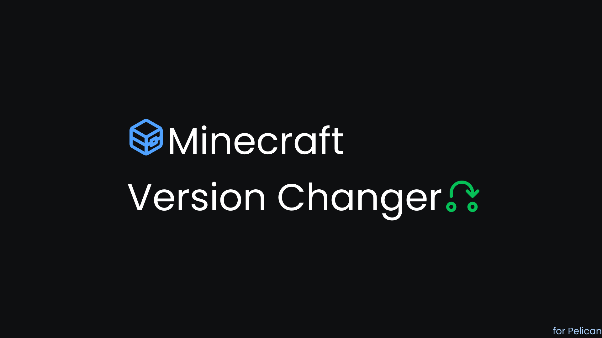

# Minecraft Version Changer

Download and install different Minecraft server versions directly from the panel using the MCJars.app API.

## Features

- Support for multiple server types (Vanilla, Paper, Purpur, Spigot, Fabric, Forge, NeoForge, etc.)
- Version selection with automatic detection of current server type
- Build selection for modded servers (Forge/NeoForge)
- Automatic ZIP extraction for modded servers (preserves libraries and dependencies)
- Server status verification (prevents installation while server is running)
- Subuser permissions (view, change)
- Feature detection to show only on compatible servers

## Supported Server Types

- Vanilla
- Paper
- Purpur
- Spigot
- Fabric
- Forge (with build selection)
- NeoForge (with build selection)
- And more...

## Installation

1. Download the plugin ZIP file from the [Releases](https://github.com/Olivier-D-Pelican-Plugins/Minecraft-Version-Changer/releases) page

2. Go to your Pelican Panel admin area

3. Navigate to the Plugins page

4. Click on "Import file"

5. Select the downloaded ZIP file

6. Click "Import"

7. In your Minecraft server's Egg, add a feature tag named `mcversionchanger` so the **MC Version** menu appears in the server panel.

## Usage

1. Navigate to the server panel
2. Click on "MC Version" in the navigation menu
3. Select your desired server type and version
4. For Forge/NeoForge, also select the specific build version
5. Stop your server
6. Click "Download & Install"

**Important:** Always backup your server files before changing versions!

## Requirements

- Pelican Panel v1.0+
- Internet connection to access MCJars.app API

## Configuration

You can configure the cache duration in `config/minecraft-version-changer.php`:

- `cache_duration` - How long to cache API responses (default: 3600 seconds)

## Author

Made by **olivierdti**
